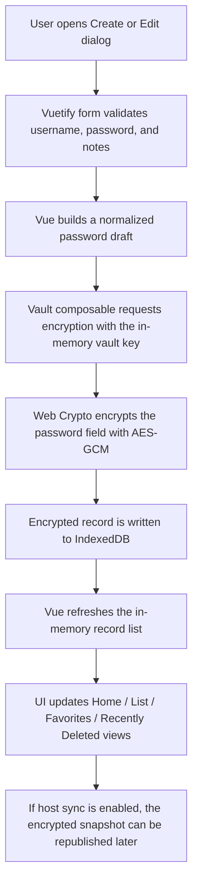
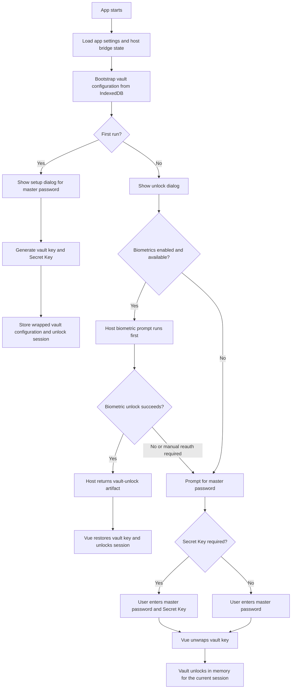

# Password Vault Hybrid

## Overview

`Password Vault Hybrid` is a local-first password manager built with `Vue 3`, `Vuetify 3`, `Vite`, and a `.NET MAUI / Blazor Hybrid` host for `Windows` and `Android`.

The project is designed around one shared frontend with zero backend dependency:

- The `Vue` app owns the vault UI, form flows, search, import/export, sync UX, theme, language, and PWA delivery.
- The `MAUI Hybrid` host embeds the same frontend and exposes native platform capabilities such as biometrics, native file dialogs, system notifications, tray behavior, and background-aware auto-locking.

The app stores encrypted vault data locally in `IndexedDB`, uses the `Web Crypto API` for browser-side encryption, and keeps host-only platform features behind a thin bridge so the web UI can stay portable.

## Highlights

- Master password setup, unlock, and password rotation
- `Secret Key` support for stronger cross-device recovery and sync unlock
- `IndexedDB` persistence with encrypted password fields at rest
- `AES-GCM` encryption through the `Web Crypto API`
- Home / List / Settings app structure with responsive UI
- Favorites, recently deleted items, batch favorite, and batch delete
- Live search across site name, username, and notes
- Random password generator
- CSV import and CSV / TXT export
- First-run onboarding
- Language switching and theme switching
- Windows Hello / Android biometric unlock through the host
- WebDAV encrypted snapshot sync
- TLS-protected LAN sync with device preview and confirmation
- Windows tray options, startup options, and tray auto-lock delay
- Android recent-tasks behavior, background auto-lock delay, and host notifications
- Browser PWA support for standalone web distribution

## Security Model

- Plaintext passwords are not stored in `localStorage`
- Password entries are stored in encrypted form inside `IndexedDB`
- The vault uses a random vault key for actual data encryption
- The master password unlocks or unwraps local access; it is not used as the raw storage format for vault records
- `Secret Key` provides an additional recovery / cross-device unlock factor
- Host biometrics store a host-protected vault-unlock artifact, not a reusable plaintext master password in the web layer
- WebDAV and LAN sync operate on encrypted full-vault snapshots
- LAN sync confirmation shows the latest item preview from both devices before replacement

## Architecture

### Frontend

- `Vue 3`
- `Composition API`
- `<script setup>`
- `Vuetify 3`
- `Vite`

### Storage and Cryptography

- `IndexedDB` for local encrypted persistence
- `PBKDF2` for password-derived wrapping
- `AES-GCM` for password field and vault payload encryption
- `Web Crypto API` for all browser-side crypto operations

### Host Layer

- `.NET MAUI`
- `HybridWebView`
- `SecureStorage`
- Windows and Android host services for biometrics, files, tray/background handling, notifications, and sync transport

## Password Save Flow



## App Unlock Flow



## PWA Support

The Vue app now includes browser-oriented PWA support:

- `manifest.webmanifest`
- `service worker`
- offline fallback page
- installable browser experience for secure web hosting

Important implementation note:

- PWA registration is intentionally limited to real browser environments
- `HybridWebView`, `WebView2`, and Android WebView hosts do **not** register the service worker
- This keeps the web release convenient for browser users while avoiding side effects in Windows and Android host packaging

## Sync Strategy

### WebDAV

- Uploads and downloads a fully encrypted vault snapshot
- Plaintext passwords are never sent to the server
- Uses a single configured remote file path per vault

### LAN Sync

- Device discovery is handled by the host layer
- Snapshot transfer is host-driven
- Transport is protected with TLS and certificate fingerprint validation
- The UI asks for confirmation before replacing the local encrypted vault snapshot
- The latest added item from both devices is shown as a sanity check before sync

## Auto-Lock and Host Notifications

### Windows

- Optional minimize-to-tray behavior
- Optional launch at startup
- Configurable delay to auto-lock after the app is hidden to tray
- System notification is sent through the Windows host when the vault auto-locks

### Android

- Optional hide-from-recents behavior
- Shortcut to relevant system auto-start / background settings
- Configurable delay to auto-lock after the app goes to background
- System notification is sent through the Android host when the vault auto-locks

## Project Structure

```text
.
|-- blazor/
|   `-- blazorApp/blazorApp/
|       |-- Platforms/
|       |-- Resources/
|       |-- Services/
|       `-- wwwroot/
|-- public/
|   |-- appicon.svg
|   |-- favicon.svg
|   |-- manifest.webmanifest
|   |-- offline.html
|   `-- sw.js
|-- scripts/
|-- src/
|   |-- components/
|   |-- composables/
|   |-- models/
|   |-- plugins/
|   |-- styles/
|   `-- utils/
|-- index.html
|-- package.json
|-- README.md
`-- vite.config.js
```

## Local Development

Install dependencies and start the web app:

```bash
npm i
npm run dev
```

Build the Vue frontend only:

```bash
npm run build
```

Build the frontend and sync the output into the MAUI host:

```bash
npm run build:hybrid
```

Sync an existing frontend build into the MAUI host:

```bash
npm run sync:maui
```

Preview the built web app:

```bash
npm run preview
```

## Host Build

Windows:

```bash
dotnet build blazor/blazorApp/blazorApp/blazorApp.csproj -f net10.0-windows10.0.19041.0
```

Android:

```bash
dotnet build blazor/blazorApp/blazorApp/blazorApp.csproj -f net10.0-android
```

If the MAUI host still references stale hashed frontend assets, clean first:

```bash
dotnet clean blazor/blazorApp/blazorApp/blazorApp.csproj -f net10.0-windows10.0.19041.0
dotnet clean blazor/blazorApp/blazorApp/blazorApp.csproj -f net10.0-android
```

## Windows Release Publishing

Generate the unpackaged Windows publish folder:

```bash
dotnet publish blazor/blazorApp/blazorApp/blazorApp.csproj -f net10.0-windows10.0.19041.0 -c Release -p:WindowsPackageType=None
```

Output:

```text
blazor/blazorApp/blazorApp/bin/Release/net10.0-windows10.0.19041.0/win-x64/publish
```

Generate the Windows installer from the project root:

```bash
npm run setup:windows
```

Output:

```text
blazor/blazorApp/blazorApp/bin/Release/Installer
```

The installer version is read from the root `package.json` `version` field first, then falls back to the MAUI host `ApplicationDisplayVersion`.

## Android Release Publishing

Generate a release APK:

```bash
npm run setup:android
```

Output:

```text
blazor/blazorApp/blazorApp/bin/Release/Android
```

The APK file name follows this pattern:

```text
PasswordVault_<version>_android.apk
```

The version is taken from the root `package.json` `version` field first, then falls back to the MAUI host `ApplicationDisplayVersion`.

## Packaging Notes

- `vite.config.js` uses relative asset paths so the frontend can run inside `HybridWebView`
- Browser debugging falls back to web file APIs when native dialogs are unavailable
- In the hybrid host, native file dialogs are preferred over browser file pickers
- The PWA service worker is only registered in secure browser contexts and is intentionally skipped inside the hybrid host
- Windows setup output is generated under `blazor/blazorApp/blazorApp/bin/Release/Installer`
- The current Windows installer packages the published app folder as-is
- For strict CSP deployments, allow at least:

```text
script-src 'self'
style-src 'self' 'unsafe-inline'
font-src 'self' data:
img-src 'self' data: blob:
connect-src 'self' https:
```

## Host Features

### Windows

- Biometric unlock
- Minimize to system tray on close
- Auto-start on system boot
- Tray auto-lock delay
- Native save/open dialogs
- Host-driven system notification on auto-lock

### Android

- Biometric unlock
- Native save/open dialogs
- Hide from recent tasks
- Background auto-lock delay
- Safe-area handling for status bar and gesture area
- Shortcut into relevant system settings for auto-start or background behavior
- Host-driven system notification on auto-lock

## Known Notes

- LAN sync currently replaces the full encrypted vault snapshot instead of doing incremental merge
- Browser PWA installation works best on `HTTPS` or `localhost`
- Android 13+ may request notification permission before auto-lock notifications can be shown
- The frontend build still emits a large chunk warning because Vuetify and icon assets are substantial

## Roadmap Ideas

- Incremental sync and conflict resolution
- Bluetooth-based sync
- Multiple vaults or category tags
- More unified motion and surface language across all views
- Stronger host-side key wrapping strategy
