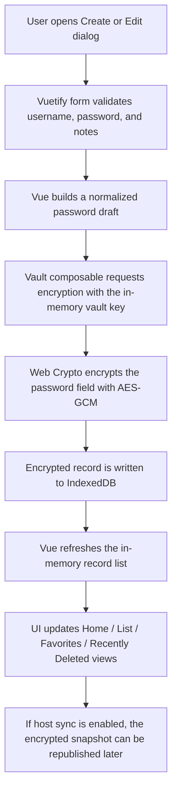
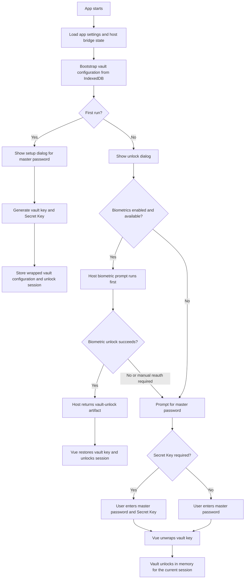

# Password Vault Hybrid

## Overview

`Password Vault Hybrid` is a local-first password manager built with `Vue 3`, `Vuetify 3`, `Vite`, and a `.NET MAUI / Blazor Hybrid` host for `Windows` and `Android`.

The project is designed around one shared frontend with zero backend dependency:

- The `Vue` app owns the vault UI, form flows, search, import/export, sync UX, theme, language, and PWA delivery.
- The `MAUI Hybrid` host embeds the same frontend and exposes native platform capabilities such as biometrics, native file dialogs, system notifications, tray behavior, and background-aware auto-locking.

The app stores encrypted vault data locally in `IndexedDB`, uses the `Web Crypto API` for browser-side encryption, and keeps host-only platform features behind a thin bridge so the web UI can stay portable.

## Release Notes

### v2.0.0

`v2.0.0` is the first release that turns Password Vault Hybrid into a broader desktop-grade vault experience. This version focuses on smoother day-to-day use, stronger migration support, better diagnostics, and the first serious Windows-only groundwork for future passkey takeover support. It also upgrades the Windows packaging flow so the main app and the passkey companion can ship together in one installer.

Highlights in `v2.0.0`:

- Refined the app structure, onboarding flow, and first-use guidance across Home / List / Settings
- Added persistent application logs with an export action under `About -> Application logs`
- Improved `1Password 1PUX / CSV` import, including better custom-field capture and a persistent review queue for items that need manual handling
- Added manual follow-up tools for ignored or incompatible import items so users can recover data instead of losing it when a review dialog is closed
- Improved recently deleted management with batch restore and batch permanent delete in settings
- Optimized vault list loading with asynchronous IndexedDB reads, incremental hydration, and lazy rendering for larger datasets
- Continued the Windows-only passkey track with metadata management, diagnostics, a background companion process, and plugin-registration / callback skeletons
- Added a dedicated passkey status surface so advanced plugin and companion diagnostics are separated from the user-facing passkey list
- Bundled the Windows passkey companion into the Windows installer flow so the setup package ships the app and companion together
- Extended WebDAV and LAN sync UX with incremental review flows and clearer conflict handling

### v1.1.0

`v1.1.0` was the first major security and host-integration milestone for Password Vault Hybrid. This release introduced the new `Secret Key`-based vault protection model, improved biometric unlock so the host stores a protected vault-unlock artifact instead of relying on the web layer to keep the master password, added configurable biometric re-auth intervals, upgraded LAN sync to a TLS-protected flow, and improved Windows / Android host behavior with safer auto-lock handling, system notifications, and mobile safe-area fixes. It also refined the app structure and onboarding experience so the product felt more complete and reliable across hybrid host environments.

Highlights in `v1.1.0`:

- Added `Secret Key` support for stronger recovery and cross-device unlock
- Reworked local encryption flow so the master password is no longer treated as the direct long-lived unlock material
- Improved biometric unlock integration for Windows and Android hosts
- Added configurable manual re-auth intervals for biometric unlock
- Secured LAN sync with TLS and fingerprint validation
- Improved Android safe-area handling and bottom navigation behavior
- Improved platform auto-lock behavior and host-driven notifications
- Refined onboarding and first-use guidance

## Highlights

- Master password setup, unlock, and password rotation
- `Secret Key` support for stronger cross-device recovery and sync unlock
- `IndexedDB` persistence with encrypted password fields at rest
- `AES-GCM` encryption through the `Web Crypto API`
- Home / List / Settings app structure with responsive UI
- Favorites, recently deleted items, batch favorite, and batch delete
- Live search across site name, username, and notes
- Random password generator
- 1Password `1PUX` / `CSV` import plus generic CSV import
- CSV / TXT export
- First-run onboarding
- Language switching and theme switching
- Windows Hello / Android biometric unlock through the host
- WebDAV encrypted snapshot sync
- TLS-protected LAN sync with device preview and confirmation
- Windows tray options, startup options, and tray auto-lock delay
- Android recent-tasks behavior, background auto-lock delay, and host notifications
- Browser PWA support for standalone web distribution

## Security Model

- Plaintext passwords are not stored in `localStorage`
- Password entries are stored in encrypted form inside `IndexedDB`
- The vault uses a random vault key for actual data encryption
- The master password unlocks or unwraps local access; it is not used as the raw storage format for vault records
- `Secret Key` provides an additional recovery / cross-device unlock factor
- Host biometrics store a host-protected vault-unlock artifact, not a reusable plaintext master password in the web layer
- WebDAV and LAN sync operate on encrypted full-vault snapshots
- LAN sync confirmation shows the latest item preview from both devices before replacement

## Architecture

### Frontend

- `Vue 3`
- `Composition API`
- `<script setup>`
- `Vuetify 3`
- `Vite`

### Storage and Cryptography

- `IndexedDB` for local encrypted persistence
- `PBKDF2` for password-derived wrapping
- `AES-GCM` for password field and vault payload encryption
- `Web Crypto API` for all browser-side crypto operations

### Host Layer

- `.NET MAUI`
- `HybridWebView`
- `SecureStorage`
- Windows and Android host services for biometrics, files, tray/background handling, notifications, and sync transport

## Design Docs

- [Windows passkey integration design](./docs/windows-passkey-design.md)
- [Windows third-party passkey manager roadmap](./docs/windows-passkey-plugin-roadmap.md)
- [Windows passkey companion scaffold](./windows-passkey-plugin/PasswordVault.PasskeyCompanion/README.md)

## Password Save Flow



## App Unlock Flow



## PWA Support

The Vue app now includes browser-oriented PWA support:

- `manifest.webmanifest`
- `service worker`
- offline fallback page
- installable browser experience for secure web hosting

Important implementation note:

- PWA registration is intentionally limited to real browser environments
- `HybridWebView`, `WebView2`, and Android WebView hosts do **not** register the service worker
- This keeps the web release convenient for browser users while avoiding side effects in Windows and Android host packaging

## Sync Strategy

### WebDAV

- Uploads and downloads a fully encrypted vault snapshot
- Plaintext passwords are never sent to the server
- Uses a single configured remote file path per vault

### LAN Sync

- Device discovery is handled by the host layer
- Snapshot transfer is host-driven
- Transport is protected with TLS and certificate fingerprint validation
- The UI asks for confirmation before replacing the local encrypted vault snapshot
- The latest added item from both devices is shown as a sanity check before sync

## Import and Migration

The app can import:

- `1Password 1PUX`
- `1Password CSV`
- generic CSV files

Current migration behavior:

- `1PUX` is treated as the preferred 1Password migration format because it preserves more structured data than CSV
- login items are prioritized during 1Password import
- extra fields such as URLs, tags, notes, and custom field values are merged into the local notes list when possible
- import conflict handling uses `site + username` matching, not just `username`
- items that cannot be imported automatically are shown in a follow-up review dialog so the user can add them manually

## Auto-Lock and Host Notifications

### Windows

- Optional minimize-to-tray behavior
- Optional launch at startup
- Configurable delay to auto-lock after the app is hidden to tray
- System notification is sent through the Windows host when the vault auto-locks

### Android

- Optional hide-from-recents behavior
- Shortcut to relevant system auto-start / background settings
- Configurable delay to auto-lock after the app goes to background
- System notification is sent through the Android host when the vault auto-locks

## Project Structure

```text
.
|-- blazor/
|   `-- blazorApp/blazorApp/
|       |-- Platforms/
|       |-- Resources/
|       |-- Services/
|       `-- wwwroot/
|-- public/
|   |-- appicon.svg
|   |-- favicon.svg
|   |-- manifest.webmanifest
|   |-- offline.html
|   `-- sw.js
|-- scripts/
|-- src/
|   |-- components/
|   |-- composables/
|   |-- models/
|   |-- plugins/
|   |-- styles/
|   `-- utils/
|-- index.html
|-- package.json
|-- README.md
`-- vite.config.js
```

## Local Development

Install dependencies and start the web app:

```bash
npm i
npm run dev
```

Build the Vue frontend only:

```bash
npm run build
```

Build the frontend and sync the output into the MAUI host:

```bash
npm run build:hybrid
```

Sync an existing frontend build into the MAUI host:

```bash
npm run sync:maui
```

Preview the built web app:

```bash
npm run preview
```

## Host Build

Windows:

```bash
dotnet build blazor/blazorApp/blazorApp/blazorApp.csproj -f net10.0-windows10.0.19041.0
```

Android:

```bash
dotnet build blazor/blazorApp/blazorApp/blazorApp.csproj -f net10.0-android
```

If the MAUI host still references stale hashed frontend assets, clean first:

```bash
dotnet clean blazor/blazorApp/blazorApp/blazorApp.csproj -f net10.0-windows10.0.19041.0
dotnet clean blazor/blazorApp/blazorApp/blazorApp.csproj -f net10.0-android
```

## Windows Passkey Companion

Build the standalone companion scaffold:

```bash
npm run build:passkey-companion
```

Apply a development-time package identity to the companion executable:

```bash
npm run debug:passkey-companion:identity
```

Build an `MSIX` package for the companion app:

```bash
npm run build:passkey-companion:msix
```

Important notes:

- These two packaging-oriented companion commands require the official `winapp` CLI to be installed on the machine
- The scripts use `windows-passkey-plugin/PasswordVault.PasskeyCompanion/appxmanifest.xml`
- Companion package assets are stored under `windows-passkey-plugin/PasswordVault.PasskeyCompanion/Assets`
- The packaged companion manifest now includes the COM-server skeleton entry that will be used by the Windows passkey plugin route
- The generated `MSIX` and development certificate files are written under:

```text
windows-passkey-plugin/PasswordVault.PasskeyCompanion/bin/Release/msix
```

## Windows Release Publishing

Generate the unpackaged Windows publish folder:

```bash
dotnet publish blazor/blazorApp/blazorApp/blazorApp.csproj -f net10.0-windows10.0.19041.0 -c Release -p:WindowsPackageType=None
```

Output:

```text
blazor/blazorApp/blazorApp/bin/Release/net10.0-windows10.0.19041.0/win-x64/publish
```

Generate the Windows installer from the project root:

```bash
npm run setup:windows
```

This installer flow now does all of the following in one run:

- builds the latest Vue frontend
- syncs the latest frontend output into the MAUI host
- publishes the Windows MAUI host
- publishes the Windows passkey companion
- bundles the companion into the installed app under `PasskeyCompanion/`
- builds the final installer

Output:

```text
blazor/blazorApp/blazorApp/bin/Release/Installer
```

The installer version is read from the root `package.json` `version` field first, then falls back to the MAUI host `ApplicationDisplayVersion`.

Important note:

- the plain `dotnet publish` command for the MAUI host only produces the main app publish folder
- the bundled installer generated by `npm run setup:windows` is the recommended way to distribute the Windows build when passkey companion support is needed

## Android Release Publishing

Generate a release APK:

```bash
npm run setup:android
```

Output:

```text
blazor/blazorApp/blazorApp/bin/Release/Android
```

The APK file name follows this pattern:

```text
PasswordVault_<version>_android.apk
```

The version is taken from the root `package.json` `version` field first, then falls back to the MAUI host `ApplicationDisplayVersion`.

## Packaging Notes

- `vite.config.js` uses relative asset paths so the frontend can run inside `HybridWebView`
- Browser debugging falls back to web file APIs when native dialogs are unavailable
- In the hybrid host, native file dialogs are preferred over browser file pickers
- The PWA service worker is only registered in secure browser contexts and is intentionally skipped inside the hybrid host
- Windows setup output is generated under `blazor/blazorApp/blazorApp/bin/Release/Installer`
- The current Windows installer packages the published app folder as-is
- For strict CSP deployments, allow at least:

```text
script-src 'self'
style-src 'self' 'unsafe-inline'
font-src 'self' data:
img-src 'self' data: blob:
connect-src 'self' https:
```

## Host Features

### Windows

- Biometric unlock
- Minimize to system tray on close
- Auto-start on system boot
- Tray auto-lock delay
- Native save/open dialogs
- Host-driven system notification on auto-lock

### Android

- Biometric unlock
- Native save/open dialogs
- Hide from recent tasks
- Background auto-lock delay
- Safe-area handling for status bar and gesture area
- Shortcut into relevant system settings for auto-start or background behavior
- Host-driven system notification on auto-lock

## Known Notes

- LAN sync and WebDAV sync now support incremental review, but conflict handling still depends on manual user choice rather than a background merge strategy
- Browser PWA installation works best on `HTTPS` or `localhost`
- Android 13+ may request notification permission before auto-lock notifications can be shown
- The frontend build still emits a large chunk warning because Vuetify and icon assets are substantial
- The Windows passkey companion packaging scripts are prepared, but `winapp` CLI is not bundled with this repository

## Roadmap Ideas

- Incremental sync and conflict resolution
- Bluetooth-based sync
- Multiple vaults or category tags
- More unified motion and surface language across all views
- Stronger host-side key wrapping strategy
